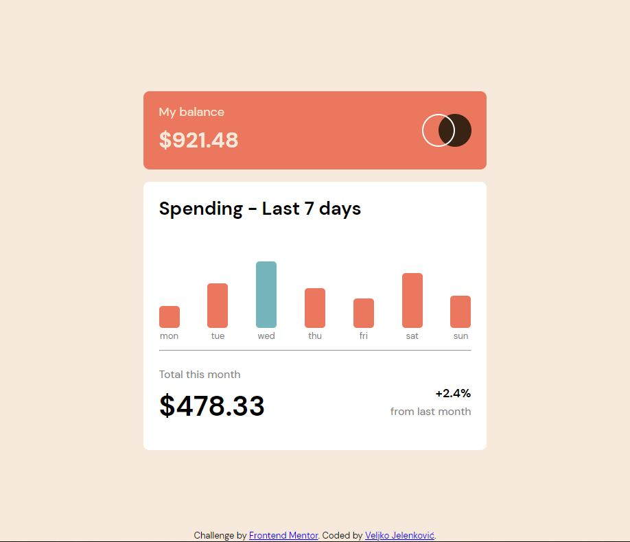
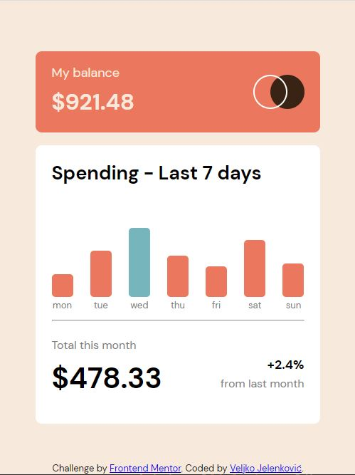

# Expenses Chart Component challenge

This is a solution to the [Expenses chart component challenge on Frontend Mentor](https://www.frontendmentor.io/challenges/expenses-chart-component-e7yJBUdjwt). Frontend Mentor challenges help you improve your coding skills by building realistic projects. 

## Table of contents

- [Overview](#overview)
  - [Screenshot](#screenshot)
  - [Links](#links)
- [Process](#process)
  - [Built with](#built-with)
- [Author](#author)

## Overview

Users should be able to:
- View the bar chart and hover over the individual bars to see the correct amounts for each day
- See the current day’s bar highlighted in a different colour to the other bars
- View the optimal layout for the content depending on their device’s screen size
- See hover states for all interactive elements on the page
- Use the JSON data file provided to dynamically size the bars on the chart

### Screenshots

Desktop and mobile design of expenses chart component.

### Link

- Live Site URL: [Expenses chart component](https://jelenkoo10.github.io/expenses_chart_component/)

## Process

### Built with

- Semantic HTML5 markup
- CSS custom properties
- CSS variables
- Asynchronous JavaScript
- Flexbox
- Mobile-first workflow

## Author

- Github - [@jelenkoo10](https://github.com/jelenkoo10)
- Frontend Mentor - [@jelenkoo10](https://www.frontendmentor.io/profile/jelenkoo10)
- LinkedIn - [Veljko Jelenković](https://www.linkedin.com/in/veljko-jelenkovi%C4%87-182981250/)